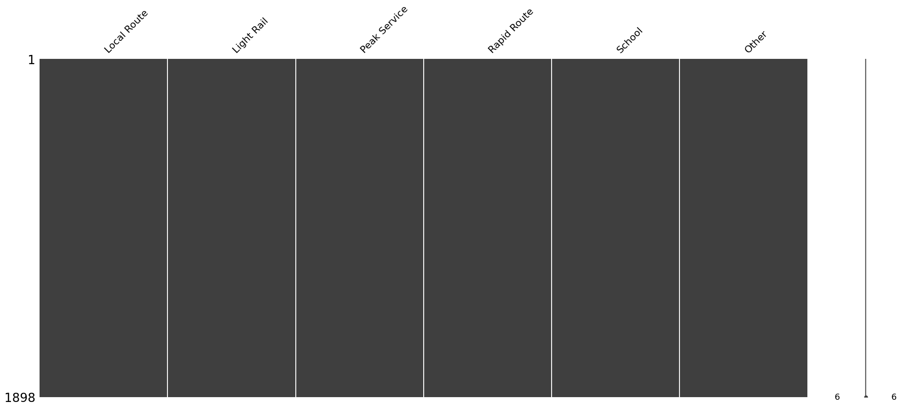
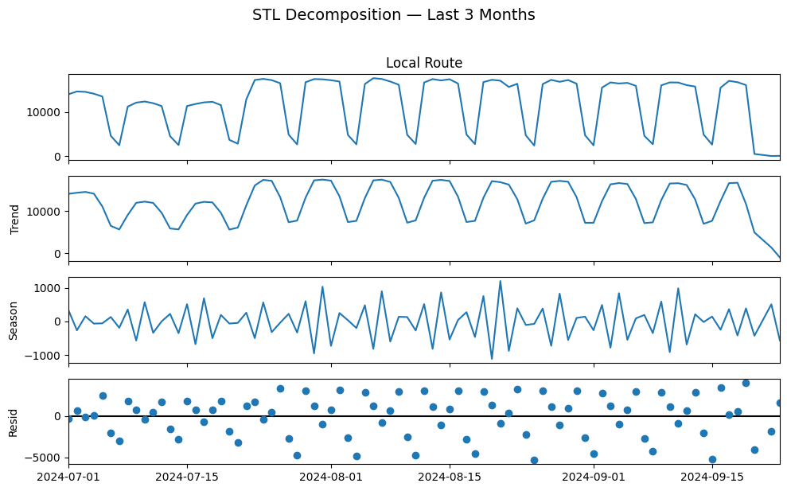
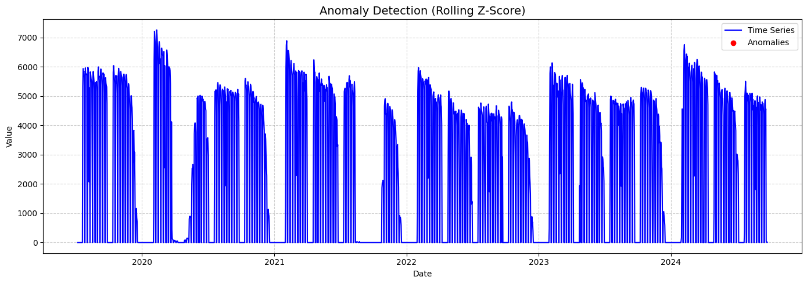
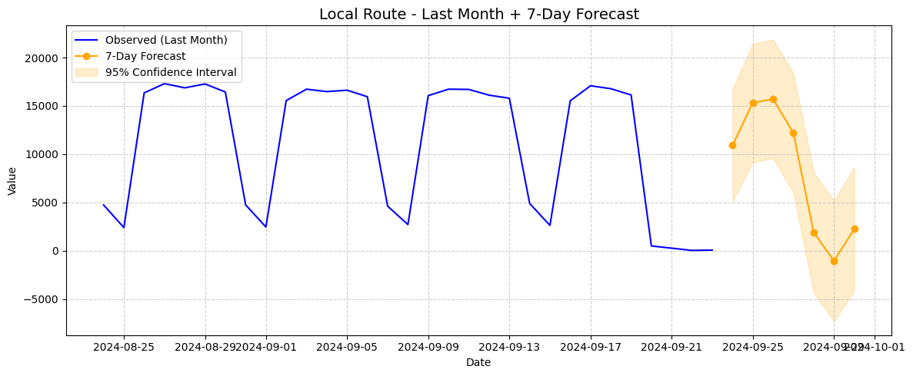
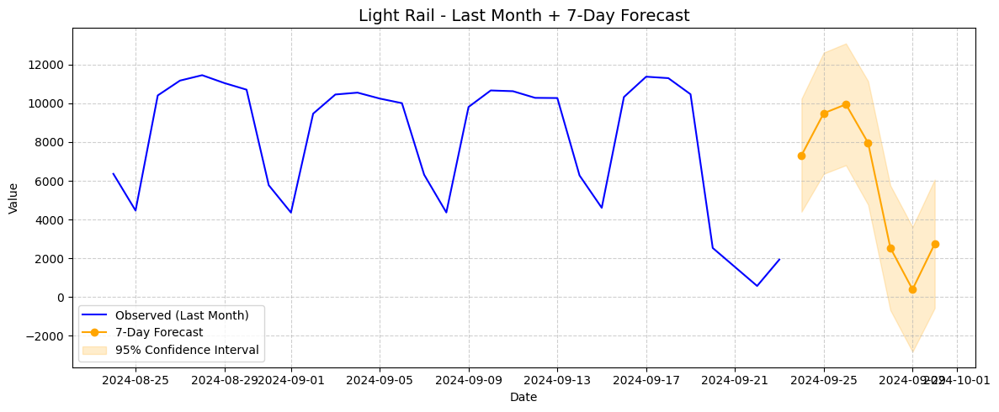
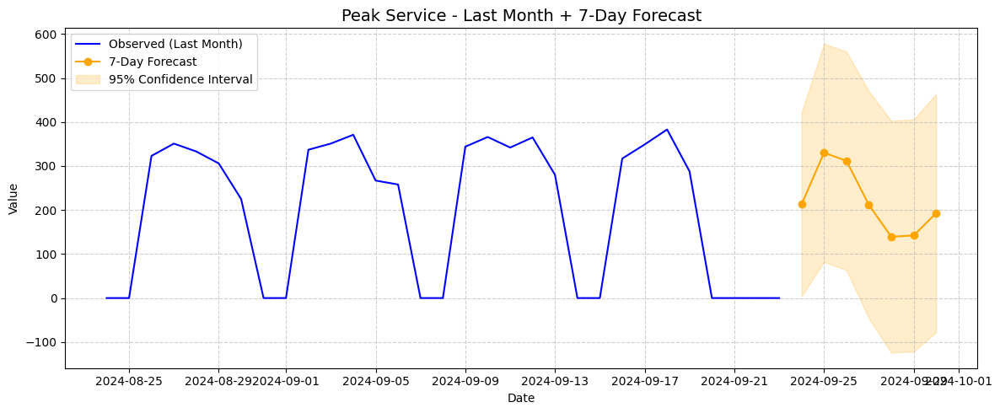
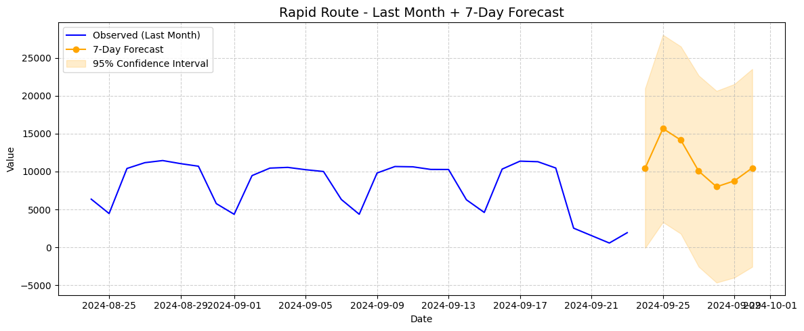
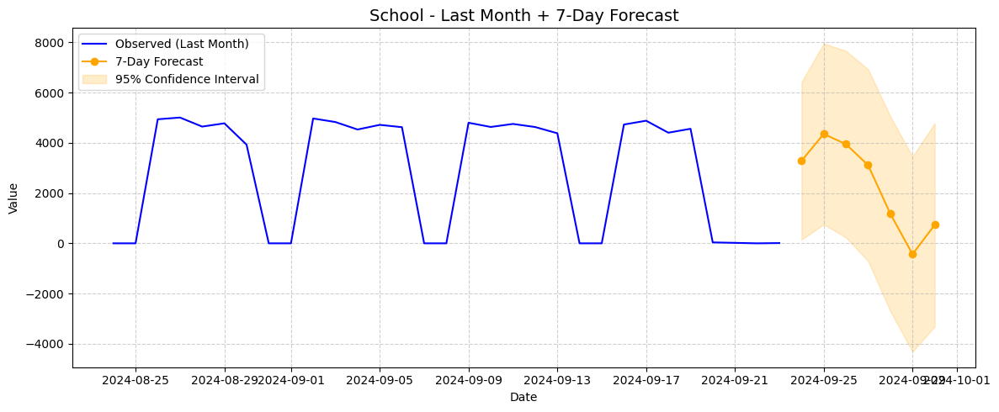

# Time Series Analysis and Forecasting Report

## Dataset Description  
The dataset contains the following features:  
- DateLocal  
- RouteLight RailPeak Service  
- Rapid Route  
- School  
- Other  

The data spans different dates and includes counts or measures for each route category. The "DateLocal" feature was set as the index and the data was sorted based on it.

## Exploratory Data Analysis (EDA)  
- Missing values and outliers were handled by dropping the respective rows to ensure clean data quality.
 
- All the time series commponents were decomposed using STL decompose method because of non-assuption characteristic.
 
- Stationarity was tested using the Augmented Dickey-Fuller (ADF) test. The p-value was found to be less than 0.05 indicating the series is non-stationary and requires differencing or other transformations. 
- Anomaly detection was carried out but no significant anomalies were detected in the data. 
 
- Autocorrelation Function (ACF) and Partial Autocorrelation Function (PACF) plots were created for all target attributes to determine appropriate model orders.

## Model Development and Results  
Five ARIMA models were fit to different routes with the following configurations and evaluation results:

| Route          | Model           | MAE (Mean Absolute Error) |
|----------------|-----------------|---------------------------|
| Local Route    | ARIMA(10,0,1)   | 1929.28                   |
| Light Rail     | ARIMA(10,0,1)   | 970.56                    |
| Peak Service   | ARIMA(3,1,1)    | 85.38                     |
| Rapid Route    | ARIMA(4,1,10)   | 4305.61                   |
| School         | ARIMA(4,1,8)    | 947.39                    |

## Forecasting for 7-days

## Insights  
1. The peak service route exhibited the lowest forecasting error (MAE 85.38), suggesting a more stable and predictable pattern compared to other routes.  
2. The rapid route showed the highest error (MAE 4305.61), indicating high variability or noise that the current ARIMA model struggled to capture.  
3. Both Local Route and Light Rail share the same ARIMA order (10,0,1) but differ significantly in forecast accuracy, implying dataset-specific dynamics beyond model structure.  
4. The stationarity test confirmed non-stationarity in most series, justifying the integration component (d) in ARIMA except for Local and Light Rail which used d=0.  
5. Outliers and missing values were completely removed; alternative imputation or robust handling strategies could improve data integrity and model performance.

## Recommendations for Future Model Improvements  
- Explore additional preprocessing such as differencing, transformation (e.g., log), or seasonal decomposition to further stabilize the series.  
- Consider more advanced forecasting techniques including seasonal ARIMA (SARIMA), exponential smoothing, or machine learning models like LSTM for complex patterns, especially for high-error routes like Rapid Route.  
- Incorporate feature engineering such as external regressors (weather, holidays) if available to enhance model explanatory power.  
- Use robust techniques for outlier detection and imputation rather than dropping data points to retain information.  
- Conduct residual diagnostics and cross-validation to fine-tune model parameters and avoid overfitting.

***