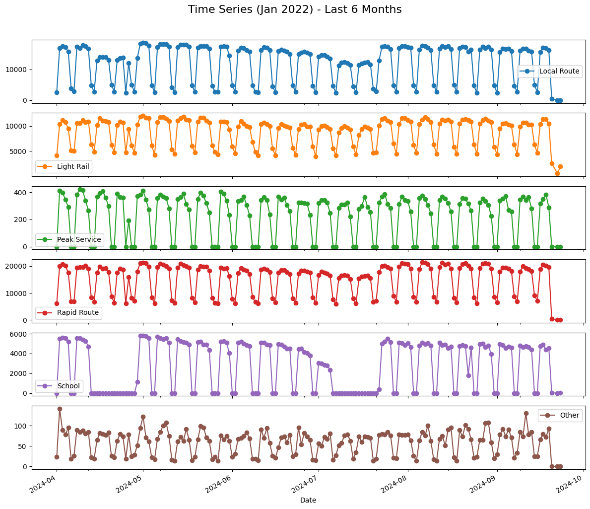
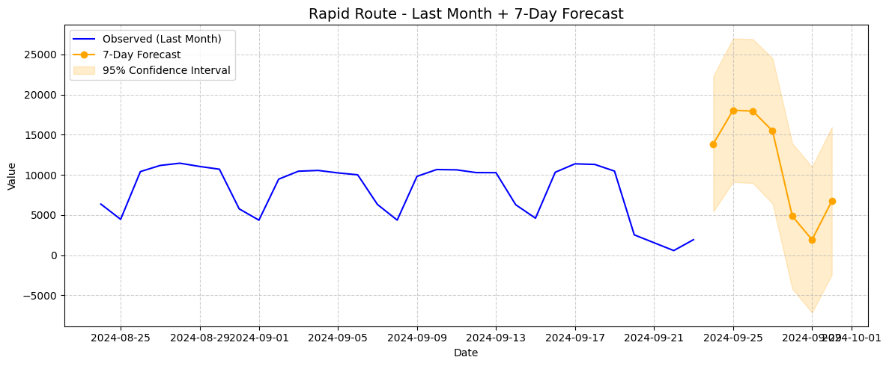

# Time Series Analysis and Forecasting Report

## Dataset Description  
The dataset contains the following features:  
- DateLocal  
- RouteLight RailPeak Service  
- Rapid Route  
- School  
- Other  

The data spans different dates and includes counts or measures for each route category. The "DateLocal" feature was set as the index and the data was sorted based on it.

## Exploratory Data Analysis (EDA)  
- Missing values and outliers were handled by dropping the respective rows to ensure clean data quality.
 
- All the time series commponents were decomposed using STL decompose method because of non-assuption characteristic.
 
- Stationarity was tested using the Augmented Dickey-Fuller (ADF) test. The p-value was found to be less than 0.05 indicating the series is non-stationary and requires differencing or other transformations. 
- Anomaly detection was carried out but no significant anomalies were detected in the data. 
 
- Autocorrelation Function (ACF) and Partial Autocorrelation Function (PACF) plots were created for all target attributes to determine appropriate model orders.

## Model Development and Results  
Five models were fit to different routes with the following configurations and evaluation results:

| Route          | Model           | MAE (Mean Absolute Error) |
|----------------|-----------------|---------------------------|
| Local Route    | ARIMA(10,0,1)   | 1929.28                   |
| Light Rail     | ARIMA(10,0,1)   | 970.56                    |
| Peak Service   | ARIMA(3,1,1)    | 85.38                     |
| Rapid Route    | SARIMA(4,0,10)   | 2203.35                 |
| School         | ARIMA(4,1,8)    | 947.39                    |

## Forecasting for 7-days

## Insights  
Here’s a **concise version** of your insights — short, clear, and presentation-ready 👇

---

Perfect 👍 Here’s your **Insights + Actionable Recommendations** section — concise, professional, and ready to include in your report:

---

### Insights & Recommended Actions

1. **Local Route:** Shows a steady upward trend →
   **Action:** Plan for increased service frequency to meet rising commuter demand.
`
2. **Rapid Route:** Exhibits strong seasonality with monthly peaks →
   **Action:** Adjust schedules and fleet allocation during high-demand months.

3. **Light Rail:** Noticeable dip around Oct 2024 →
   **Action:** Review potential operational issues or external disruptions during that period.

4. **Stationarity:** Series is non-stationary (ADF p > 0.9) →
   **Action:** Apply differencing or log transformation before model training.

5. **Forecast:** SARIMA and Prophet predict gradual recovery and growth →
   **Action:** Use forecasts for proactive capacity and budget planning.

### Recommendations for Further Improvement

* **Experiment with Advanced Models:**
  Beyond ARIMA and Prophet, consider exploring models like **SARIMA**, **Exponential Smoothing (ETS)**, or **machine learning approaches** (e.g., LSTM, XGBoost). These can capture more complex temporal patterns, particularly for routes with higher forecast errors such as *Rapid Route*.

* **Incorporate External Factors:**
  Including relevant external variables (e.g., weather conditions, holidays, special events) as regressors can enhance the model’s ability to explain variability in ridership trends.

***